

  

<h2 align=center>Clique <a href="https://pokestore.netlify.app/">aqui</a> para ver a live demo.</h2>

## O que é?

A PokéStore é o projeto que desenvolvi no processo seletivo da <a href="https://ri.b2w.digital/">B2W Digital</a>. O objetivo do desafio era vivênciar a experiência de construir uma loja virtual mostrando como eu imaginaria uma loja de Pokémon(o que foi uma surpresa muito boa já que sou fã da série).

## User Stories

Os Pokémon devem ser exibidos a partir da <a href="https://pokeapi.co/">pokeapi</a>, uma api RESTful com dados de quase todos os Pokémon. Os preços poderiam ser definidos aleatoriamente, entretanto eu decidi fazer uma fórmula para o preço que é:` número de letras do nome do Pokémon * 50`. Exemplo: Turtwig (7 letras):` 7 * 50 = 350`. 

-   [x] Catálogo de produtos
-   [x] Carrinho lateral
-   [x] Resumo do carrinho
-   [x] 2 lojas com estilos e tipos diferentes de Pokémon (escolhe o tipo grama e o tipo psíquico)

## Bonus features

-   [x] Barra de busca para filtrar os Pokémon
-   [x] Botão de finalizar compra, reiniciando o processo de compra
-   [x] Modal de obrigado ao finalizar compra
-   [x] Salvar os dados da compra do usuário localmente para não perdê-las ao atualizar a página

## Tecnologias usadas

-   [x] ReactJS
-   [x] React Router 
-   [x] Context API
-   [x] Styled Components (CSS in JS)
-   [x] Axios (HTTP Client)
-   [x] SweetAlert2

# Sobre o desenvolvimento

Para auxiliar no desenvolvimento foi disponibilizado um wireframe de como a loja deveria aparentar:
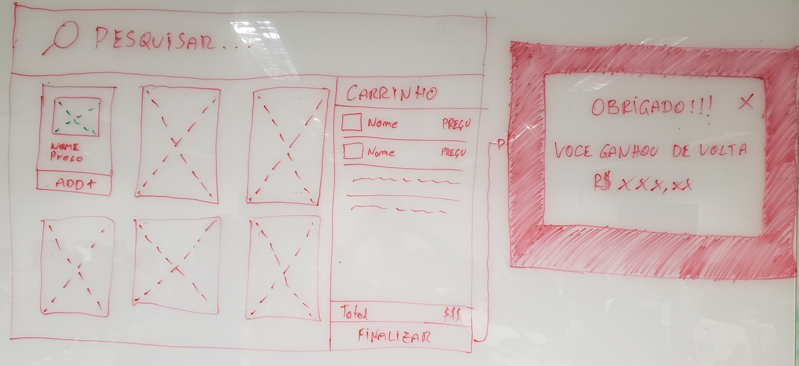

Com o wireframe em mãos, corri para o figma para fazer um protótipo em alta fidelidade. UX/UI não é minha praia mas desenvolvo melhor e mais rápido com o design já feito.

 
  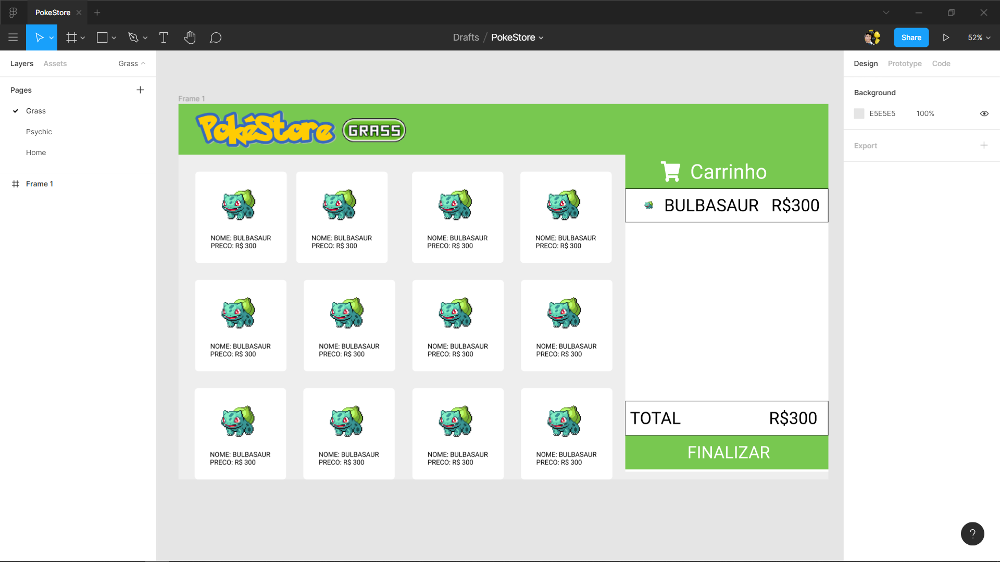
  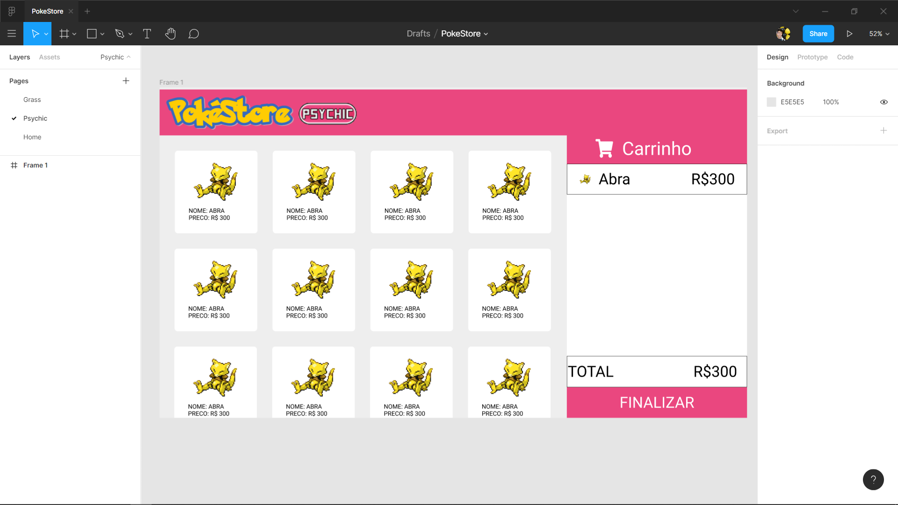

Além das páginas da loja desenhei uma página Home bem simples.
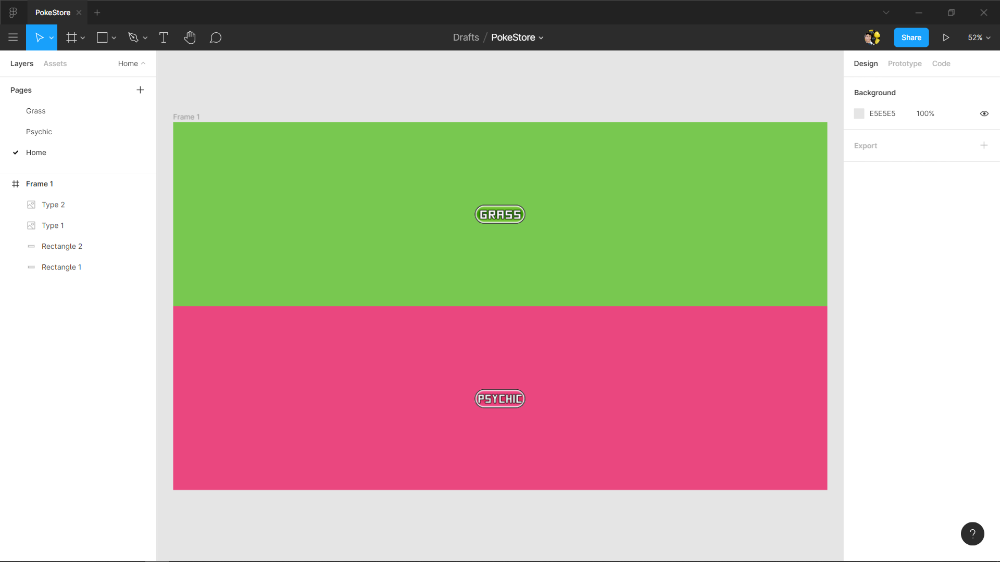

Pronto, eu já tinha tudo o que precisava para começar a desenvolver. Rodei o Create React App e comecei a codar. O resultado final foi esse:

### Home
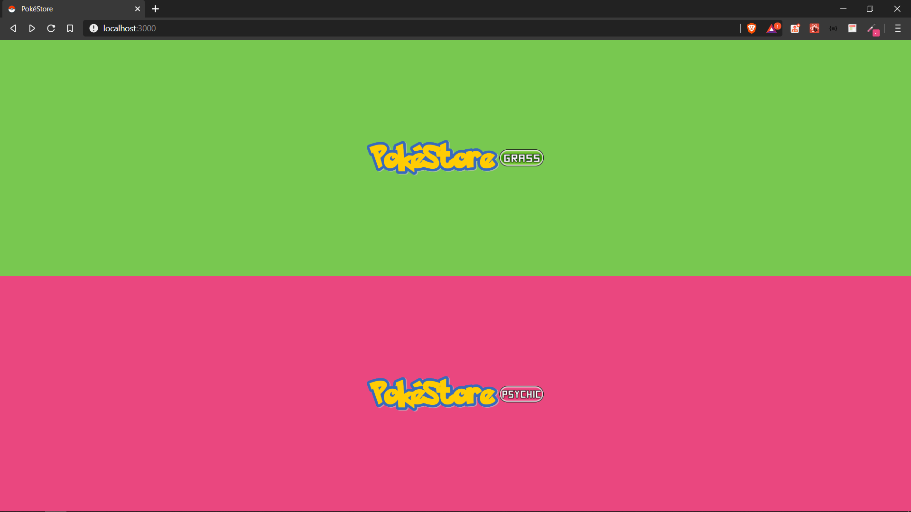

<h3 align=center > Loja tipo grama & Loja tipo psíquico </h3>

 
  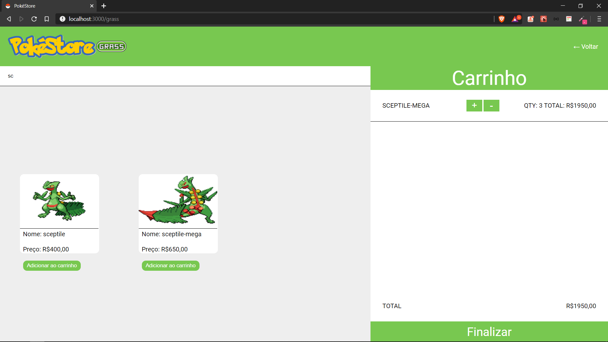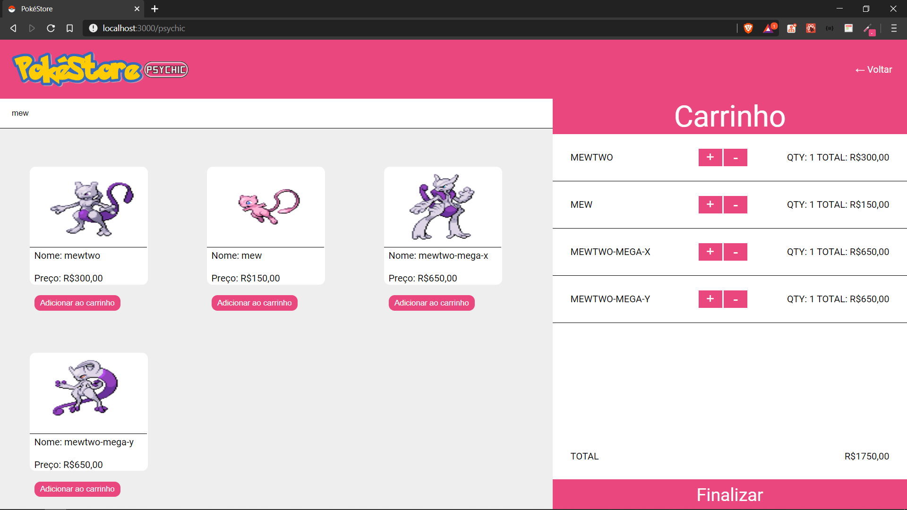

### Modal ao finalizar a compra (O "ganhou de volta" foi inspirado no AME, mas na PokéStore só devolvemos 5%).
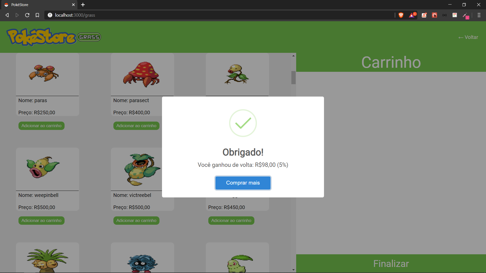

E é claro que tinha que ser responsivo. No mobile o carrinho lateral tem um botão de toggle para exibir ou não ele.

### Home mobile
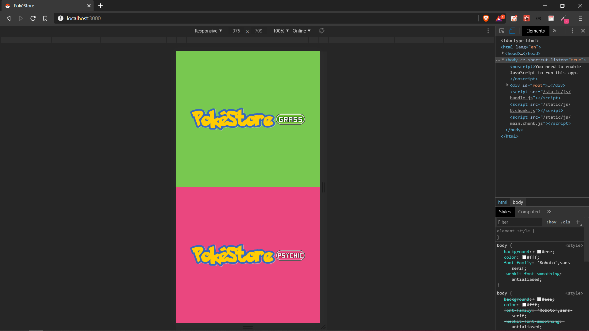

### Loja com carrinho/sem carrinho
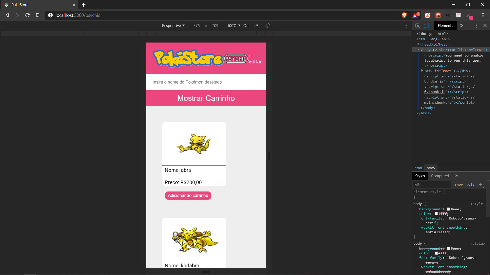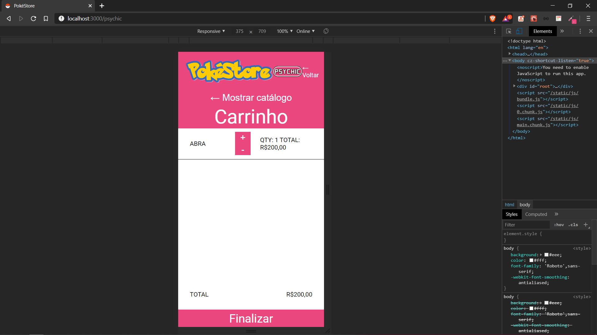

# Funcionalidades do app

Reservo este espaço para explicar algumas coisas que acontecem no **cart hook (`./src/hooks/cart.js`)** e na exibição dos Pokémon.

### Adicionando tipo do Pokémon

Todos os Pokémon que são adicionados ao carrinho ficam salvos no state `pokemon` no **CartProvider(`./src/hooks/cart.js`)**. Para adicionar o tipo do Pokémon eu usei o `window.location.pathname`. Ele me retorna uma string com o pathname da página onde o usuário está. No caso, ele poderia devolver duas strings que serão o tipo do Pokémon diferentes: ` "/grass"` ou `"/psychic"`.

### Uso do tipo do Pokémon

Como todos os Pokémon do carrinho ficam no mesmo state foi necessário criar um filtro para renderizar os Pokémon de um tipo na sua respectiva página.

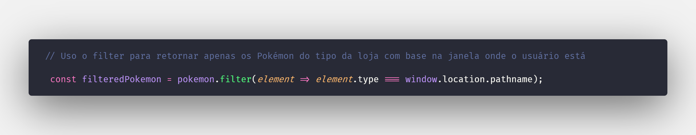

Esse mesmo filtro é usado no **CartProvider(`./src/hooks/cart.js`)** para limpar o carrinho após finalizar a compra. Entretanto no **CartProvider** ele é usado invertido, ao invés de filtrar os Pokémon da página ele filtra os do tipo oposto e salva o state apenas com eles. Dessa maneira, o carrinho da página atual é limpo e o da outra continua.

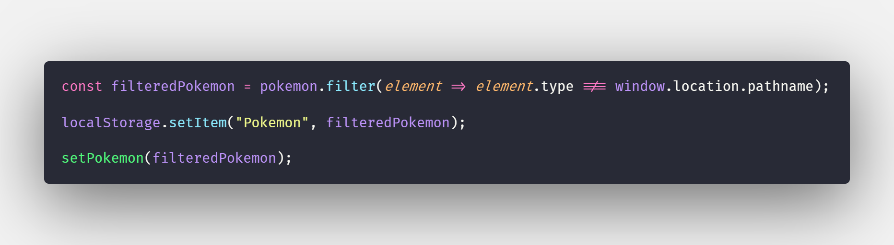
